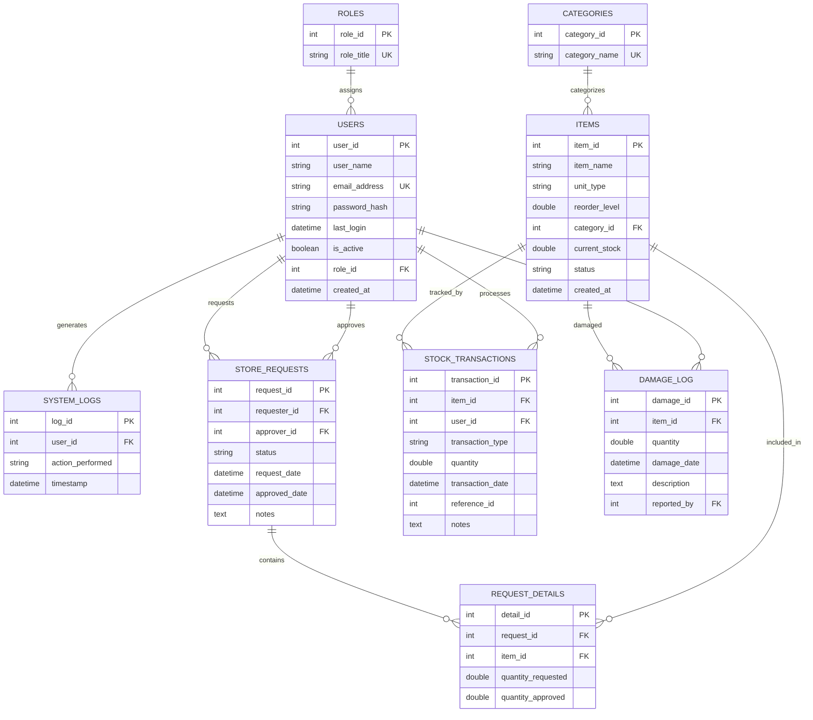

# FoodFlow Database ER Diagram (Crow's Foot Notation)

## Complete Entity-Relationship Diagram



## Detailed Relationship Descriptions

### User Management Section

#### ROLES → USERS (One-to-Many)
- **Cardinality:** One role can be assigned to many users
- **Relationship Type:** Identifying relationship
- **Foreign Key:** `users.role_id` → `roles.role_id`
- **Cascade:** ON DELETE CASCADE

```
ROLES (1) ────────< (Many) USERS
│                     │
│ Role_ID (PK)        │ User_ID (PK)
│ Role_Title          │ User_Name
│                     │ Email_Address
│                     │ Password_Hash
│                     │ Last_Login
│                     │ Is_Active
│                     │ Role_ID (FK) ───┘
```

#### USERS → SYSTEM_LOGS (One-to-Many)
- **Cardinality:** One user can generate many log entries
- **Relationship Type:** Non-identifying relationship
- **Foreign Key:** `system_logs.user_id` → `users.user_id`
- **Cascade:** ON DELETE CASCADE

```
USERS (1) ────────< (Many) SYSTEM_LOGS
│                      │
│ User_ID (PK)         │ Log_ID (PK)
│ User_Name            │ User_ID (FK) ───┐
│ Email_Address        │ Action_Performed│
└──────────────────────│ Timestamp       │
                       └─────────────────┘
```

### Inventory Section

#### CATEGORIES → ITEMS (One-to-Many)
- **Cardinality:** One category can contain many items
- **Relationship Type:** Identifying relationship
- **Foreign Key:** `items.category_id` → `categories.category_id`
- **Cascade:** ON DELETE CASCADE

```
CATEGORIES (1) ────────< (Many) ITEMS
│                          │
│ Category_ID (PK)         │ Item_ID (PK)
│ Category_Name            │ Item_Name
│                          │ Unit_Type
│                          │ Reorder_Level
│                          │ Category_ID (FK) ──┐
│                          │ Current_Stock      │
│                          │ Status             │
└──────────────────────────┴────────────────────┘
```

### Request & Transactions Section

#### Dual Relationship: USERS → STORE_REQUESTS

**Relationship 1: As Requester**
- **Cardinality:** One user can make many store requests
- **Foreign Key:** `store_requests.requester_id` → `users.user_id`
- **Cascade:** ON DELETE CASCADE

**Relationship 2: As Approver**
- **Cardinality:** One user can approve many store requests
- **Foreign Key:** `store_requests.approver_id` → `users.user_id`
- **Cascade:** ON DELETE SET NULL

```
                         STORE_REQUESTS
                         ┌─────────────────────┐
                         │ Request_ID (PK)     │
                         │ Requester_ID (FK)───┼──┐
                         │ Approver_ID (FK)───┼──┤
                         │ Status              │  │
                         │ Request_Date        │  │
                         │ Approved_Date       │  │
                         │ Notes               │  │
                         └─────────────────────┘  │
                                                  │
                    ┌─────────────────────────────┘
                    │
        ┌───────────┴───────────┐
        │                       │
    USERS (1)               USERS (1)
    (Requester)             (Approver)
    ┌──────────┐           ┌──────────┐
    │User_ID   │           │User_ID   │
    │(PK)      │           │(PK)      │
    │User_Name │           │User_Name │
    │Email     │           │Email     │
    │Role_ID   │           │Role_ID   │
    └──────────┘           └──────────┘
```

#### STORE_REQUESTS → REQUEST_DETAILS (One-to-Many)
- **Cardinality:** One request can have many line items
- **Foreign Key:** `request_details.request_id` → `store_requests.request_id`
- **Cascade:** ON DELETE CASCADE

#### ITEMS → REQUEST_DETAILS (One-to-Many)
- **Cardinality:** One item can appear in many request details
- **Foreign Key:** `request_details.item_id` → `items.item_id`
- **Cascade:** ON DELETE CASCADE

```
STORE_REQUESTS (1) ─────< (Many) REQUEST_DETAILS >───── (1) ITEMS
┌─────────────────┐              ┌─────────────────┐         ┌──────────┐
│ Request_ID (PK) │              │ Detail_ID (PK)  │         │Item_ID   │
│ Requester_ID    │              │ Request_ID (FK) │         │(PK)      │
│ Approver_ID     │              │ Item_ID (FK) ───┼─────────│Item_Name │
│ Status          │              │ Qty_Requested   │         │Unit_Type │
│ Request_Date    │              │ Qty_Approved    │         └──────────┘
└─────────────────┘              └─────────────────┘
```

#### ITEMS → STOCK_TRANSACTIONS (One-to-Many)
- **Cardinality:** One item can have many transactions
- **Foreign Key:** `stock_transactions.item_id` → `items.item_id`
- **Cascade:** ON DELETE CASCADE

#### USERS → STOCK_TRANSACTIONS (One-to-Many)
- **Cardinality:** One user can process many transactions
- **Foreign Key:** `stock_transactions.user_id` → `users.user_id`
- **Cascade:** ON DELETE CASCADE

```
                         STOCK_TRANSACTIONS
                         ┌──────────────────────┐
                         │ Transaction_ID (PK)  │
                         │ Item_ID (FK) ────────┼──┐
                         │ User_ID (FK) ────────┼──┤
                         │ Transaction_Type     │  │
                         │ (IN/OUT/DAMAGED)     │  │
                         │ Quantity             │  │
                         │ Transaction_Date     │  │
                         │ Reference_ID         │  │
                         │ Notes                │  │
                         └──────────────────────┘  │
                                                   │
                    ┌──────────────────────────────┘
                    │
        ┌───────────┴───────────┐
        │                       │
    ITEMS (1)               USERS (1)
    ┌──────────┐           ┌──────────┐
    │Item_ID   │           │User_ID   │
    │(PK)      │           │(PK)      │
    │Item_Name │           │User_Name │
    │Stock     │           │Email     │
    │Category  │           │Role      │
    └──────────┘           └──────────┘
```

#### ITEMS → DAMAGE_LOG (One-to-Many)
- **Cardinality:** One item can have many damage incidents
- **Foreign Key:** `damage_log.item_id` → `items.item_id`
- **Cascade:** ON DELETE CASCADE

#### USERS → DAMAGE_LOG (One-to-Many)
- **Cardinality:** One user can report many damage incidents
- **Foreign Key:** `damage_log.reported_by` → `users.user_id`
- **Cascade:** ON DELETE CASCADE

```
                         DAMAGE_LOG
                         ┌─────────────────┐
                         │ Damage_ID (PK)  │
                         │ Item_ID (FK) ───┼──┐
                         │ Quantity        │  │
                         │ Damage_Date     │  │
                         │ Description      │  │
                         │ Reported_By(FK)─┼──┤
                         └─────────────────┘  │
                                              │
                    ┌─────────────────────────┘
                    │
        ┌───────────┴───────────┐
        │                       │
    ITEMS (1)               USERS (1)
    ┌──────────┐           ┌──────────┐
    │Item_ID   │           │User_ID   │
    │(PK)      │           │(PK)      │
    │Item_Name │           │User_Name │
    │Stock     │           │Email     │
    └──────────┘           └──────────┘
```

## Table Specifications

### 1. ROLES Table
```sql
CREATE TABLE roles (
    role_id INT PRIMARY KEY AUTO_INCREMENT,
    role_title VARCHAR(50) NOT NULL UNIQUE
);
```

**Sample Data:**
| role_id | role_title |
|---------|------------|
| 1 | ADMIN |
| 2 | DEPARTMENT_HEAD |
| 3 | COOK |

### 2. USERS Table
```sql
CREATE TABLE users (
    user_id INT PRIMARY KEY AUTO_INCREMENT,
    user_name VARCHAR(100) NOT NULL,
    email_address VARCHAR(100) UNIQUE NOT NULL,
    password_hash VARCHAR(255) NOT NULL,
    last_login DATETIME,
    is_active BOOLEAN DEFAULT TRUE,
    role_id INT NOT NULL,
    created_at DATETIME DEFAULT CURRENT_TIMESTAMP,
    FOREIGN KEY (role_id) REFERENCES roles(role_id) ON DELETE CASCADE
);
```

### 3. SYSTEM_LOGS Table
```sql
CREATE TABLE system_logs (
    log_id INT PRIMARY KEY AUTO_INCREMENT,
    user_id INT NOT NULL,
    action_performed VARCHAR(255) NOT NULL,
    timestamp DATETIME DEFAULT CURRENT_TIMESTAMP,
    FOREIGN KEY (user_id) REFERENCES users(user_id) ON DELETE CASCADE
);
```

### 4. CATEGORIES Table
```sql
CREATE TABLE categories (
    category_id INT PRIMARY KEY AUTO_INCREMENT,
    category_name VARCHAR(100) NOT NULL UNIQUE
);
```

**Sample Data:**
| category_id | category_name |
|-------------|---------------|
| 1 | PERISHABLE |
| 2 | NON_PERISHABLE |
| 3 | UTENSILS |
| 4 | CLEANING_SUPPLIES |

### 5. ITEMS Table
```sql
CREATE TABLE items (
    item_id INT PRIMARY KEY AUTO_INCREMENT,
    item_name VARCHAR(100) NOT NULL,
    unit_type VARCHAR(50) NOT NULL,
    reorder_level DOUBLE DEFAULT 10.0,
    category_id INT NOT NULL,
    current_stock DOUBLE DEFAULT 0.0,
    status VARCHAR(50) DEFAULT 'AVAILABLE',
    created_at DATETIME DEFAULT CURRENT_TIMESTAMP,
    FOREIGN KEY (category_id) REFERENCES categories(category_id) ON DELETE CASCADE
);
```

### 6. STORE_REQUESTS Table
```sql
CREATE TABLE store_requests (
    request_id INT PRIMARY KEY AUTO_INCREMENT,
    requester_id INT NOT NULL,
    approver_id INT,
    status VARCHAR(50) DEFAULT 'PENDING',
    request_date DATETIME DEFAULT CURRENT_TIMESTAMP,
    approved_date DATETIME,
    notes TEXT,
    FOREIGN KEY (requester_id) REFERENCES users(user_id) ON DELETE CASCADE,
    FOREIGN KEY (approver_id) REFERENCES users(user_id) ON DELETE SET NULL
);
```

**Note:** This table has TWO foreign keys to USERS table:
- `requester_id` - The user making the request
- `approver_id` - The user approving the request

### 7. REQUEST_DETAILS Table
```sql
CREATE TABLE request_details (
    detail_id INT PRIMARY KEY AUTO_INCREMENT,
    request_id INT NOT NULL,
    item_id INT NOT NULL,
    quantity_requested DOUBLE NOT NULL,
    quantity_approved DOUBLE DEFAULT 0.0,
    FOREIGN KEY (request_id) REFERENCES store_requests(request_id) ON DELETE CASCADE,
    FOREIGN KEY (item_id) REFERENCES items(item_id) ON DELETE CASCADE
);
```

### 8. STOCK_TRANSACTIONS Table (Unified)
```sql
CREATE TABLE stock_transactions (
    transaction_id INT PRIMARY KEY AUTO_INCREMENT,
    item_id INT NOT NULL,
    user_id INT NOT NULL,
    transaction_type VARCHAR(50) NOT NULL, -- IN, OUT, DAMAGED, BORROWED, RETURNED
    quantity DOUBLE NOT NULL,
    transaction_date DATETIME DEFAULT CURRENT_TIMESTAMP,
    reference_id INT, -- Can link to request_id
    notes TEXT,
    FOREIGN KEY (item_id) REFERENCES items(item_id) ON DELETE CASCADE,
    FOREIGN KEY (user_id) REFERENCES users(user_id) ON DELETE CASCADE
);
```

**Transaction Types:**
- **IN** - Stock received (supplies)
- **OUT** - Stock consumed (usage)
- **DAMAGED** - Stock damaged
- **BORROWED** - Items borrowed
- **RETURNED** - Items returned

### 9. DAMAGE_LOG Table
```sql
CREATE TABLE damage_log (
    damage_id INT PRIMARY KEY AUTO_INCREMENT,
    item_id INT NOT NULL,
    quantity DOUBLE NOT NULL,
    damage_date DATETIME DEFAULT CURRENT_TIMESTAMP,
    description TEXT,
    reported_by INT NOT NULL,
    FOREIGN KEY (item_id) REFERENCES items(item_id) ON DELETE CASCADE,
    FOREIGN KEY (reported_by) REFERENCES users(user_id) ON DELETE CASCADE
);
```

## Index Recommendations

For optimal performance, consider adding these indexes:

```sql
-- Frequently queried columns
CREATE INDEX idx_users_role ON users(role_id);
CREATE INDEX idx_users_email ON users(email_address);
CREATE INDEX idx_items_category ON items(category_id);
CREATE INDEX idx_items_status ON items(status);
CREATE INDEX idx_transactions_item ON stock_transactions(item_id);
CREATE INDEX idx_transactions_user ON stock_transactions(user_id);
CREATE INDEX idx_transactions_date ON stock_transactions(transaction_date);
CREATE INDEX idx_transactions_type ON stock_transactions(transaction_type);
CREATE INDEX idx_requests_requester ON store_requests(requester_id);
CREATE INDEX idx_requests_approver ON store_requests(approver_id);
CREATE INDEX idx_requests_status ON store_requests(status);
CREATE INDEX idx_logs_user ON system_logs(user_id);
CREATE INDEX idx_logs_timestamp ON system_logs(timestamp);
```

## Constraints Summary

### Primary Keys (PK)
All tables use `INT AUTO_INCREMENT` primary keys for consistency

### Foreign Keys (FK)
1. `users.role_id` → `roles.role_id` (CASCADE)
2. `system_logs.user_id` → `users.user_id` (CASCADE)
3. `items.category_id` → `categories.category_id` (CASCADE)
4. `store_requests.requester_id` → `users.user_id` (CASCADE)
5. `store_requests.approver_id` → `users.user_id` (SET NULL)
6. `request_details.request_id` → `store_requests.request_id` (CASCADE)
7. `request_details.item_id` → `items.item_id` (CASCADE)
8. `stock_transactions.item_id` → `items.item_id` (CASCADE)
9. `stock_transactions.user_id` → `users.user_id` (CASCADE)
10. `damage_log.item_id` → `items.item_id` (CASCADE)
11. `damage_log.reported_by` → `users.user_id` (CASCADE)

### Unique Constraints
- `roles.role_title`
- `users.email_address`
- `categories.category_name`

### Check Constraints (Implicit via Application Logic)
- `items.current_stock >= 0`
- `stock_transactions.quantity > 0`
- `damage_log.quantity > 0`
- `request_details.quantity_requested > 0`

---

**Document Version:** 1.0  
**Last Updated:** March 2026
